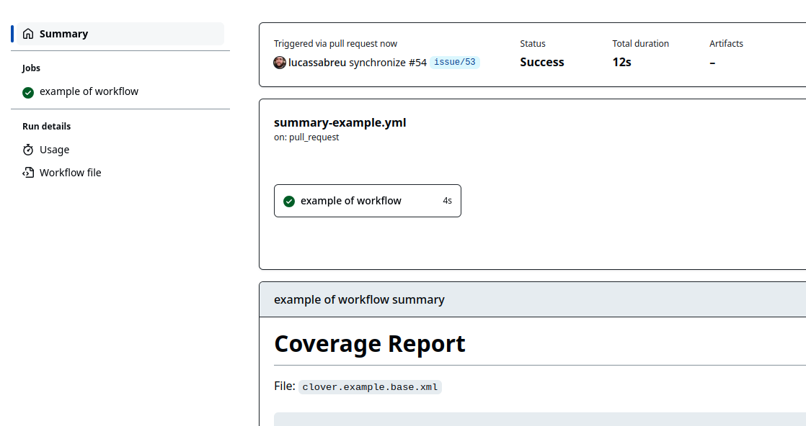

> **Note**
> 
> GitHub Marketplace may not show all the avaliable releases, check the repository for the newest release.

Comment Coverage (Clover)
=========================

This action reads a Clover Coverage Report and creates one (and only one) comment on the Pull Request
related to the run with a summary of the report.

It was highly inspired on the project: [danhunsaker/clover-reporter-action],
but with expanded configuration to better suit the needs on our projects.

PR Comment Example
------------------

Coverage report for commit: `9f99ed3`

File: `clover.example.base.xml`

  <details><summary>Summary - <b>Lines:</b> <span title="1,894 out of 2,153">87.97%</span> <span title="Was 88.03%, now is 87.97%">:arrow_down_small:</span> | <b>Methods:</b> <span title="355 out of 438">81.05%</span> <span title="Was 81.01%, now is 81.05%">:arrow_up_small:</span></summary><br/><table><thead><tr><th>Files</th><th>Lines</th><th>Methods</th><th>Branches</th></tr></thead><tbody><tr><td colspan=4><b>src/main/php/PHPMD</b></td></tr><tr><td>&nbsp; &nbsp;<a href="https://github.com/lucassabreu/comment-coverage-clover/blob/8a14a4f05af18bdc1376ec78fc148813204c2e7d/src/main/php/PHPMD/AbstractNode.php">AbstractNode.php</a></td><td><span title="37 out of 43">86.05%</span></td><td><span title="12 out of 17">70.59%</span></td><td><span title="0 out of 0">-</span></td></tr><tr><td>&nbsp; &nbsp;<a href="https://github.com/lucassabreu/comment-coverage-clover/blob/8a14a4f05af18bdc1376ec78fc148813204c2e7d/src/main/php/PHPMD/AbstractRenderer.php">AbstractRenderer.php</a></td><td><span title="2 out of 2">100.00%</span></td><td><span title="2 out of 2">100.00%</span></td><td><span title="0 out of 0">-</span></td></tr><tr><td>&nbsp; &nbsp;<a href="https://github.com/lucassabreu/comment-coverage-clover/blob/8a14a4f05af18bdc1376ec78fc148813204c2e7d/src/main/php/PHPMD/AbstractRule.php">AbstractRule.php</a></td><td><span title="28 out of 35">80.00%</span></td><td><span title="18 out of 25">72.00%</span></td><td><span title="0 out of 0">-</span></td></tr><tr><td>&nbsp; &nbsp;<a href="https://github.com/lucassabreu/comment-coverage-clover/blob/8a14a4f05af18bdc1376ec78fc148813204c2e7d/src/main/php/PHPMD/PHPMD.php">PHPMD.php</a></td><td><span title="28 out of 31">90.32%</span></td><td><span title="9 out of 12">75.00%</span></td><td><span title="0 out of 0">-</span></td></tr><tr><td>&nbsp; &nbsp;<a href="https://github.com/lucassabreu/comment-coverage-clover/blob/8a14a4f05af18bdc1376ec78fc148813204c2e7d/src/main/php/PHPMD/Parser.php">Parser.php</a></td><td><span title="33 out of 37">89.19%</span></td><td><span title="13 out of 14">92.86%</span></td><td><span title="0 out of 0">-</span></td></tr><tr><td>&nbsp; &nbsp;<a href="https://github.com/lucassabreu/comment-coverage-clover/blob/8a14a4f05af18bdc1376ec78fc148813204c2e7d/src/main/php/PHPMD/ParserFactory.php">ParserFactory.php</a></td><td><span title="29 out of 32">90.63%</span></td><td><span title="5 out of 7">71.43%</span></td><td><span title="0 out of 0">-</span></td></tr><tr><td>&nbsp; &nbsp;<a href="https://github.com/lucassabreu/comment-coverage-clover/blob/8a14a4f05af18bdc1376ec78fc148813204c2e7d/src/main/php/PHPMD/ProcessingError.php">ProcessingError.php</a></td><td><span title="9 out of 9">100.00%</span></td><td><span title="4 out of 4">100.00%</span></td><td><span title="0 out of 0">-</span></td></tr><tr><td>&nbsp; &nbsp;<a href="https://github.com/lucassabreu/comment-coverage-clover/blob/8a14a4f05af18bdc1376ec78fc148813204c2e7d/src/main/php/PHPMD/Report.php">Report.php</a></td><td><span title="24 out of 24">100.00%</span></td><td><span title="10 out of 10">100.00%</span></td><td><span title="0 out of 0">-</span></td></tr><tr><td>&nbsp; &nbsp;<a href="https://github.com/lucassabreu/comment-coverage-clover/blob/8a14a4f05af18bdc1376ec78fc148813204c2e7d/src/main/php/PHPMD/RuleSet.php">RuleSet.php</a></td><td><span title="27 out of 31">87.10%</span></td><td><span title="10 out of 14">71.43%</span></td><td><span title="0 out of 0">-</span></td></tr><tr><td>&nbsp; &nbsp;<a href="https://github.com/lucassabreu/comment-coverage-clover/blob/8a14a4f05af18bdc1376ec78fc148813204c2e7d/src/main/php/PHPMD/RuleSetFactory.php">RuleSetFactory.php</a></td><td><span title="157 out of 163">96.32%</span></td><td><span title="19 out of 22">86.36%</span></td><td><span title="0 out of 0">-</span></td></tr><tr><td>&nbsp; &nbsp;<a href="https://github.com/lucassabreu/comment-coverage-clover/blob/8a14a4f05af18bdc1376ec78fc148813204c2e7d/src/main/php/PHPMD/RuleViolation.php">RuleViolation.php</a></td><td><span title="22 out of 30">73.33%</span></td><td><span title="4 out of 12">33.33%</span></td><td><span title="0 out of 0">-</span></td></tr><tr><td colspan=4><b>src/main/php/PHPMD/Baseline</b></td></tr><tr><td>&nbsp; &nbsp;<a href="https://github.com/lucassabreu/comment-coverage-clover/blob/8a14a4f05af18bdc1376ec78fc148813204c2e7d/src/main/php/PHPMD/Baseline/BaselineFileFinder.php">BaselineFileFinder.php</a></td><td><span title="20 out of 20">100.00%</span></td><td><span title="5 out of 5">100.00%</span></td><td><span title="0 out of 0">-</span></td></tr><tr><td>&nbsp; &nbsp;<a href="https://github.com/lucassabreu/comment-coverage-clover/blob/8a14a4f05af18bdc1376ec78fc148813204c2e7d/src/main/php/PHPMD/Baseline/BaselineSet.php">BaselineSet.php</a></td><td><span title="8 out of 8">100.00%</span></td><td><span title="2 out of 2">100.00%</span></td><td><span title="0 out of 0">-</span></td></tr><tr><td>&nbsp; &nbsp;<a href="https://github.com/lucassabreu/comment-coverage-clover/blob/8a14a4f05af18bdc1376ec78fc148813204c2e7d/src/main/php/PHPMD/Baseline/BaselineSetFactory.php">BaselineSetFactory.php</a></td><td><span title="21 out of 21">100.00%</span></td><td><span title="1 out of 1">100.00%</span></td><td><span title="0 out of 0">-</span></td></tr><tr><td>&nbsp; &nbsp;<a href="https://github.com/lucassabreu/comment-coverage-clover/blob/8a14a4f05af18bdc1376ec78fc148813204c2e7d/src/main/php/PHPMD/Baseline/BaselineValidator.php">BaselineValidator.php</a></td><td><span title="11 out of 11">100.00%</span></td><td><span title="2 out of 2">100.00%</span></td><td><span title="0 out of 0">-</span></td></tr><tr><td>&nbsp; &nbsp;<a href="https://github.com/lucassabreu/comment-coverage-clover/blob/8a14a4f05af18bdc1376ec78fc148813204c2e7d/src/main/php/PHPMD/Baseline/ViolationBaseline.php">ViolationBaseline.php</a></td><td><span title="6 out of 6">100.00%</span></td><td><span title="4 out of 4">100.00%</span></td><td><span title="0 out of 0">-</span></td></tr><tr><td colspan=4><b>src/main/php/PHPMD/Exception</b></td></tr><tr><td>&nbsp; &nbsp;<a href="https://github.com/lucassabreu/comment-coverage-clover/blob/8a14a4f05af18bdc1376ec78fc148813204c2e7d/src/main/php/PHPMD/Exception/RuleClassFileNotFoundException.php">RuleClassFileNotFoundException.php</a></td><td><span title="1 out of 1">100.00%</span></td><td><span title="1 out of 1">100.00%</span></td><td><span title="0 out of 0">-</span></td></tr><tr><td>&nbsp; &nbsp;<a href="https://github.com/lucassabreu/comment-coverage-clover/blob/8a14a4f05af18bdc1376ec78fc148813204c2e7d/src/main/php/PHPMD/Exception/RuleClassNotFoundException.php">RuleClassNotFoundException.php</a></td><td><span title="1 out of 1">100.00%</span></td><td><span title="1 out of 1">100.00%</span></td><td><span title="0 out of 0">-</span></td></tr><tr><td>&nbsp; &nbsp;<a href="https://github.com/lucassabreu/comment-coverage-clover/blob/8a14a4f05af18bdc1376ec78fc148813204c2e7d/src/main/php/PHPMD/Exception/RuleSetNotFoundException.php">RuleSetNotFoundException.php</a></td><td><span title="1 out of 1">100.00%</span></td><td><span title="1 out of 1">100.00%</span></td><td><span title="0 out of 0">-</span></td></tr><tr><td colspan=4><b>src/main/php/PHPMD/Node</b></td></tr><tr><td>&nbsp; &nbsp;<a href="https://github.com/lucassabreu/comment-coverage-clover/blob/8a14a4f05af18bdc1376ec78fc148813204c2e7d/src/main/php/PHPMD/Node/ASTNode.php">ASTNode.php</a></td><td><span title="9 out of 9">100.00%</span></td><td><span title="8 out of 8">100.00%</span></td><td><span title="0 out of 0">-</span></td></tr><tr><td>&nbsp; &nbsp;<a href="https://github.com/lucassabreu/comment-coverage-clover/blob/8a14a4f05af18bdc1376ec78fc148813204c2e7d/src/main/php/PHPMD/Node/AbstractCallableNode.php">AbstractCallableNode.php</a></td><td><span title="2 out of 2">100.00%</span></td><td><span title="2 out of 2">100.00%</span></td><td><span title="0 out of 0">-</span></td></tr><tr><td>&nbsp; &nbsp;<a href="https://github.com/lucassabreu/comment-coverage-clover/blob/8a14a4f05af18bdc1376ec78fc148813204c2e7d/src/main/php/PHPMD/Node/AbstractNode.php">AbstractNode.php</a></td><td><span title="3 out of 3">100.00%</span></td><td><span title="1 out of 1">100.00%</span></td><td><span title="0 out of 0">-</span></td></tr><tr><td>&nbsp; &nbsp;<a href="https://github.com/lucassabreu/comment-coverage-clover/blob/8a14a4f05af18bdc1376ec78fc148813204c2e7d/src/main/php/PHPMD/Node/AbstractTypeNode.php">AbstractTypeNode.php</a></td><td><span title="14 out of 14">100.00%</span></td><td><span title="7 out of 7">100.00%</span></td><td><span title="0 out of 0">-</span></td></tr><tr><td>&nbsp; &nbsp;<a href="https://github.com/lucassabreu/comment-coverage-clover/blob/8a14a4f05af18bdc1376ec78fc148813204c2e7d/src/main/php/PHPMD/Node/Annotation.php">Annotation.php</a></td><td><span title="12 out of 12">100.00%</span></td><td><span title="3 out of 3">100.00%</span></td><td><span title="0 out of 0">-</span></td></tr><tr><td>&nbsp; &nbsp;<a href="https://github.com/lucassabreu/comment-coverage-clover/blob/8a14a4f05af18bdc1376ec78fc148813204c2e7d/src/main/php/PHPMD/Node/Annotations.php">Annotations.php</a></td><td><span title="9 out of 9">100.00%</span></td><td><span title="2 out of 2">100.00%</span></td><td><span title="0 out of 0">-</span></td></tr><tr><td>&nbsp; &nbsp;<a href="https://github.com/lucassabreu/comment-coverage-clover/blob/8a14a4f05af18bdc1376ec78fc148813204c2e7d/src/main/php/PHPMD/Node/ClassNode.php">ClassNode.php</a></td><td><span title="1 out of 1">100.00%</span></td><td><span title="1 out of 1">100.00%</span></td><td><span title="0 out of 0">-</span></td></tr><tr><td>&nbsp; &nbsp;<a href="https://github.com/lucassabreu/comment-coverage-clover/blob/8a14a4f05af18bdc1376ec78fc148813204c2e7d/src/main/php/PHPMD/Node/FunctionNode.php">FunctionNode.php</a></td><td><span title="2 out of 4">50.00%</span></td><td><span title="2 out of 4">50.00%</span></td><td><span title="0 out of 0">-</span></td></tr><tr><td>&nbsp; &nbsp;<a href="https://github.com/lucassabreu/comment-coverage-clover/blob/8a14a4f05af18bdc1376ec78fc148813204c2e7d/src/main/php/PHPMD/Node/InterfaceNode.php">InterfaceNode.php</a></td><td><span title="1 out of 1">100.00%</span></td><td><span title="1 out of 1">100.00%</span></td><td><span title="0 out of 0">-</span></td></tr><tr><td>&nbsp; &nbsp;<a href="https://github.com/lucassabreu/comment-coverage-clover/blob/8a14a4f05af18bdc1376ec78fc148813204c2e7d/src/main/php/PHPMD/Node/MethodNode.php">MethodNode.php</a></td><td><span title="32 out of 32">100.00%</span></td><td><span title="8 out of 8">100.00%</span></td><td><span title="0 out of 0">-</span></td></tr><tr><td>&nbsp; &nbsp;<a href="https://github.com/lucassabreu/comment-coverage-clover/blob/8a14a4f05af18bdc1376ec78fc148813204c2e7d/src/main/php/PHPMD/Node/TraitNode.php">TraitNode.php</a></td><td><span title="1 out of 1">100.00%</span></td><td><span title="1 out of 1">100.00%</span></td><td><span title="0 out of 0">-</span></td></tr><tr><td colspan=4><b>src/main/php/PHPMD/Renderer</b></td></tr><tr><td>&nbsp; &nbsp;<a href="https://github.com/lucassabreu/comment-coverage-clover/blob/8a14a4f05af18bdc1376ec78fc148813204c2e7d/src/main/php/PHPMD/Renderer/BaselineRenderer.php">BaselineRenderer.php</a></td><td><span title="20 out of 20">100.00%</span></td><td><span title="2 out of 2">100.00%</span></td><td><span title="0 out of 0">-</span></td></tr><tr><td>&nbsp; &nbsp;<a href="https://github.com/lucassabreu/comment-coverage-clover/blob/8a14a4f05af18bdc1376ec78fc148813204c2e7d/src/main/php/PHPMD/Renderer/GitHubRenderer.php">GitHubRenderer.php</a></td><td><span title="15 out of 15">100.00%</span></td><td><span title="1 out of 1">100.00%</span></td><td><span title="0 out of 0">-</span></td></tr><tr><td>&nbsp; &nbsp;<a href="https://github.com/lucassabreu/comment-coverage-clover/blob/8a14a4f05af18bdc1376ec78fc148813204c2e7d/src/main/php/PHPMD/Renderer/HTMLRenderer.php">HTMLRenderer.php</a></td><td><span title="102 out of 119">85.71%</span></td><td><span title="7 out of 11">63.64%</span></td><td><span title="0 out of 0">-</span></td></tr><tr><td>&nbsp; &nbsp;<a href="https://github.com/lucassabreu/comment-coverage-clover/blob/8a14a4f05af18bdc1376ec78fc148813204c2e7d/src/main/php/PHPMD/Renderer/JSONRenderer.php">JSONRenderer.php</a></td><td><span title="39 out of 39">100.00%</span></td><td><span title="5 out of 5">100.00%</span></td><td><span title="0 out of 0">-</span></td></tr><tr><td>&nbsp; &nbsp;<a href="https://github.com/lucassabreu/comment-coverage-clover/blob/8a14a4f05af18bdc1376ec78fc148813204c2e7d/src/main/php/PHPMD/Renderer/RendererFactory.php">RendererFactory.php</a></td><td><span title="4 out of 4">100.00%</span></td><td><span title="1 out of 1">100.00%</span></td><td><span title="0 out of 0">-</span></td></tr><tr><td>&nbsp; &nbsp;<a href="https://github.com/lucassabreu/comment-coverage-clover/blob/8a14a4f05af18bdc1376ec78fc148813204c2e7d/src/main/php/PHPMD/Renderer/SARIFRenderer.php">SARIFRenderer.php</a></td><td><span title="60 out of 61">98.36%</span></td><td><span title="4 out of 5">80.00%</span></td><td><span title="0 out of 0">-</span></td></tr><tr><td>&nbsp; &nbsp;<a href="https://github.com/lucassabreu/comment-coverage-clover/blob/8a14a4f05af18bdc1376ec78fc148813204c2e7d/src/main/php/PHPMD/Renderer/TextRenderer.php">TextRenderer.php</a></td><td><span title="13 out of 13">100.00%</span></td><td><span title="1 out of 1">100.00%</span></td><td><span title="0 out of 0">-</span></td></tr><tr><td>&nbsp; &nbsp;<a href="https://github.com/lucassabreu/comment-coverage-clover/blob/8a14a4f05af18bdc1376ec78fc148813204c2e7d/src/main/php/PHPMD/Renderer/XMLRenderer.php">XMLRenderer.php</a></td><td><span title="41 out of 41">100.00%</span></td><td><span title="3 out of 3">100.00%</span></td><td><span title="0 out of 0">-</span></td></tr><tr><td colspan=4><b>src/main/php/PHPMD/Rule</b></td></tr><tr><td>&nbsp; &nbsp;<a href="https://github.com/lucassabreu/comment-coverage-clover/blob/8a14a4f05af18bdc1376ec78fc148813204c2e7d/src/main/php/PHPMD/Rule/AbstractLocalVariable.php">AbstractLocalVariable.php</a></td><td><span title="62 out of 71">87.32%</span></td><td><span title="9 out of 13">69.23%</span></td><td><span title="0 out of 0">-</span></td></tr><tr><td>&nbsp; &nbsp;<a href="https://github.com/lucassabreu/comment-coverage-clover/blob/8a14a4f05af18bdc1376ec78fc148813204c2e7d/src/main/php/PHPMD/Rule/CyclomaticComplexity.php">CyclomaticComplexity.php</a></td><td><span title="10 out of 10">100.00%</span></td><td><span title="1 out of 1">100.00%</span></td><td><span title="0 out of 0">-</span></td></tr><tr><td>&nbsp; &nbsp;<a href="https://github.com/lucassabreu/comment-coverage-clover/blob/8a14a4f05af18bdc1376ec78fc148813204c2e7d/src/main/php/PHPMD/Rule/ExcessivePublicCount.php">ExcessivePublicCount.php</a></td><td><span title="10 out of 10">100.00%</span></td><td><span title="1 out of 1">100.00%</span></td><td><span title="0 out of 0">-</span></td></tr><tr><td>&nbsp; &nbsp;<a href="https://github.com/lucassabreu/comment-coverage-clover/blob/8a14a4f05af18bdc1376ec78fc148813204c2e7d/src/main/php/PHPMD/Rule/UnusedFormalParameter.php">UnusedFormalParameter.php</a></td><td><span title="55 out of 55">100.00%</span></td><td><span title="10 out of 10">100.00%</span></td><td><span title="0 out of 0">-</span></td></tr><tr><td>&nbsp; &nbsp;<a href="https://github.com/lucassabreu/comment-coverage-clover/blob/8a14a4f05af18bdc1376ec78fc148813204c2e7d/src/main/php/PHPMD/Rule/UnusedLocalVariable.php">UnusedLocalVariable.php</a></td><td><span title="63 out of 65">96.92%</span></td><td><span title="11 out of 13">84.62%</span></td><td><span title="0 out of 0">-</span></td></tr><tr><td>&nbsp; &nbsp;<a href="https://github.com/lucassabreu/comment-coverage-clover/blob/8a14a4f05af18bdc1376ec78fc148813204c2e7d/src/main/php/PHPMD/Rule/UnusedPrivateField.php">UnusedPrivateField.php</a></td><td><span title="42 out of 43">97.67%</span></td><td><span title="8 out of 9">88.89%</span></td><td><span title="0 out of 0">-</span></td></tr><tr><td>&nbsp; &nbsp;<a href="https://github.com/lucassabreu/comment-coverage-clover/blob/8a14a4f05af18bdc1376ec78fc148813204c2e7d/src/main/php/PHPMD/Rule/UnusedPrivateMethod.php">UnusedPrivateMethod.php</a></td><td><span title="25 out of 25">100.00%</span></td><td><span title="6 out of 6">100.00%</span></td><td><span title="0 out of 0">-</span></td></tr><tr><td colspan=4><b>src/main/php/PHPMD/Rule/CleanCode</b></td></tr><tr><td>&nbsp; &nbsp;<a href="https://github.com/lucassabreu/comment-coverage-clover/blob/8a14a4f05af18bdc1376ec78fc148813204c2e7d/src/main/php/PHPMD/Rule/CleanCode/DuplicatedArrayKey.php">DuplicatedArrayKey.php</a></td><td><span title="27 out of 32">84.38%</span></td><td><span title="2 out of 4">50.00%</span></td><td><span title="0 out of 0">-</span></td></tr><tr><td>&nbsp; &nbsp;<a href="https://github.com/lucassabreu/comment-coverage-clover/blob/8a14a4f05af18bdc1376ec78fc148813204c2e7d/src/main/php/PHPMD/Rule/CleanCode/ElseExpression.php">ElseExpression.php</a></td><td><span title="9 out of 10">90.00%</span></td><td><span title="2 out of 3">66.67%</span></td><td><span title="0 out of 0">-</span></td></tr><tr><td>&nbsp; &nbsp;<a href="https://github.com/lucassabreu/comment-coverage-clover/blob/8a14a4f05af18bdc1376ec78fc148813204c2e7d/src/main/php/PHPMD/Rule/CleanCode/ErrorControlOperator.php">ErrorControlOperator.php</a></td><td><span title="3 out of 3">100.00%</span></td><td><span title="1 out of 1">100.00%</span></td><td><span title="0 out of 0">-</span></td></tr><tr><td>&nbsp; &nbsp;<a href="https://github.com/lucassabreu/comment-coverage-clover/blob/8a14a4f05af18bdc1376ec78fc148813204c2e7d/src/main/php/PHPMD/Rule/CleanCode/IfStatementAssignment.php">IfStatementAssignment.php</a></td><td><span title="19 out of 20">95.00%</span></td><td><span title="4 out of 5">80.00%</span></td><td><span title="0 out of 0">-</span></td></tr><tr><td>&nbsp; &nbsp;<a href="https://github.com/lucassabreu/comment-coverage-clover/blob/8a14a4f05af18bdc1376ec78fc148813204c2e7d/src/main/php/PHPMD/Rule/CleanCode/MissingImport.php">MissingImport.php</a></td><td><span title="15 out of 16">93.75%</span></td><td><span title="2 out of 3">66.67%</span></td><td><span title="0 out of 0">-</span></td></tr><tr><td>&nbsp; &nbsp;<a href="https://github.com/lucassabreu/comment-coverage-clover/blob/8a14a4f05af18bdc1376ec78fc148813204c2e7d/src/main/php/PHPMD/Rule/CleanCode/StaticAccess.php">StaticAccess.php</a></td><td><span title="22 out of 22">100.00%</span></td><td><span title="7 out of 7">100.00%</span></td><td><span title="0 out of 0">-</span></td></tr><tr><td>&nbsp; &nbsp;<a href="https://github.com/lucassabreu/comment-coverage-clover/blob/8a14a4f05af18bdc1376ec78fc148813204c2e7d/src/main/php/PHPMD/Rule/CleanCode/UndefinedVariable.php">UndefinedVariable.php</a></td><td><span title="66 out of 75">88.00%</span></td><td><span title="9 out of 14">64.29%</span></td><td><span title="0 out of 0">-</span></td></tr><tr><td colspan=4><b>src/main/php/PHPMD/Rule/Controversial</b></td></tr><tr><td>&nbsp; &nbsp;<a href="https://github.com/lucassabreu/comment-coverage-clover/blob/8a14a4f05af18bdc1376ec78fc148813204c2e7d/src/main/php/PHPMD/Rule/Controversial/CamelCaseMethodName.php">CamelCaseMethodName.php</a></td><td><span title="11 out of 11">100.00%</span></td><td><span title="2 out of 2">100.00%</span></td><td><span title="0 out of 0">-</span></td></tr><tr><td>&nbsp; &nbsp;<a href="https://github.com/lucassabreu/comment-coverage-clover/blob/8a14a4f05af18bdc1376ec78fc148813204c2e7d/src/main/php/PHPMD/Rule/Controversial/CamelCaseParameterName.php">CamelCaseParameterName.php</a></td><td><span title="8 out of 8">100.00%</span></td><td><span title="2 out of 2">100.00%</span></td><td><span title="0 out of 0">-</span></td></tr><tr><td>&nbsp; &nbsp;<a href="https://github.com/lucassabreu/comment-coverage-clover/blob/8a14a4f05af18bdc1376ec78fc148813204c2e7d/src/main/php/PHPMD/Rule/Controversial/CamelCasePropertyName.php">CamelCasePropertyName.php</a></td><td><span title="10 out of 10">100.00%</span></td><td><span title="1 out of 1">100.00%</span></td><td><span title="0 out of 0">-</span></td></tr><tr><td>&nbsp; &nbsp;<a href="https://github.com/lucassabreu/comment-coverage-clover/blob/8a14a4f05af18bdc1376ec78fc148813204c2e7d/src/main/php/PHPMD/Rule/Controversial/CamelCaseVariableName.php">CamelCaseVariableName.php</a></td><td><span title="15 out of 16">93.75%</span></td><td><span title="1 out of 2">50.00%</span></td><td><span title="0 out of 0">-</span></td></tr><tr><td colspan=4><b>src/main/php/PHPMD/Rule/Design</b></td></tr><tr><td>&nbsp; &nbsp;<a href="https://github.com/lucassabreu/comment-coverage-clover/blob/8a14a4f05af18bdc1376ec78fc148813204c2e7d/src/main/php/PHPMD/Rule/Design/CountInLoopExpression.php">CountInLoopExpression.php</a></td><td><span title="28 out of 30">93.33%</span></td><td><span title="4 out of 5">80.00%</span></td><td><span title="0 out of 0">-</span></td></tr><tr><td>&nbsp; &nbsp;<a href="https://github.com/lucassabreu/comment-coverage-clover/blob/8a14a4f05af18bdc1376ec78fc148813204c2e7d/src/main/php/PHPMD/Rule/Design/CouplingBetweenObjects.php">CouplingBetweenObjects.php</a></td><td><span title="4 out of 4">100.00%</span></td><td><span title="1 out of 1">100.00%</span></td><td><span title="0 out of 0">-</span></td></tr><tr><td>&nbsp; &nbsp;<a href="https://github.com/lucassabreu/comment-coverage-clover/blob/8a14a4f05af18bdc1376ec78fc148813204c2e7d/src/main/php/PHPMD/Rule/Design/DepthOfInheritance.php">DepthOfInheritance.php</a></td><td><span title="13 out of 14">92.86%</span></td><td><span title="0 out of 1">0.00%</span></td><td><span title="0 out of 0">-</span></td></tr><tr><td>&nbsp; &nbsp;<a href="https://github.com/lucassabreu/comment-coverage-clover/blob/8a14a4f05af18bdc1376ec78fc148813204c2e7d/src/main/php/PHPMD/Rule/Design/DevelopmentCodeFragment.php">DevelopmentCodeFragment.php</a></td><td><span title="21 out of 21">100.00%</span></td><td><span title="2 out of 2">100.00%</span></td><td><span title="0 out of 0">-</span></td></tr><tr><td>&nbsp; &nbsp;<a href="https://github.com/lucassabreu/comment-coverage-clover/blob/8a14a4f05af18bdc1376ec78fc148813204c2e7d/src/main/php/PHPMD/Rule/Design/EmptyCatchBlock.php">EmptyCatchBlock.php</a></td><td><span title="4 out of 4">100.00%</span></td><td><span title="1 out of 1">100.00%</span></td><td><span title="0 out of 0">-</span></td></tr><tr><td>&nbsp; &nbsp;<a href="https://github.com/lucassabreu/comment-coverage-clover/blob/8a14a4f05af18bdc1376ec78fc148813204c2e7d/src/main/php/PHPMD/Rule/Design/EvalExpression.php">EvalExpression.php</a></td><td><span title="2 out of 2">100.00%</span></td><td><span title="1 out of 1">100.00%</span></td><td><span title="0 out of 0">-</span></td></tr><tr><td>&nbsp; &nbsp;<a href="https://github.com/lucassabreu/comment-coverage-clover/blob/8a14a4f05af18bdc1376ec78fc148813204c2e7d/src/main/php/PHPMD/Rule/Design/ExitExpression.php">ExitExpression.php</a></td><td><span title="2 out of 2">100.00%</span></td><td><span title="1 out of 1">100.00%</span></td><td><span title="0 out of 0">-</span></td></tr><tr><td>&nbsp; &nbsp;<a href="https://github.com/lucassabreu/comment-coverage-clover/blob/8a14a4f05af18bdc1376ec78fc148813204c2e7d/src/main/php/PHPMD/Rule/Design/GotoStatement.php">GotoStatement.php</a></td><td><span title="2 out of 2">100.00%</span></td><td><span title="1 out of 1">100.00%</span></td><td><span title="0 out of 0">-</span></td></tr><tr><td>&nbsp; &nbsp;<a href="https://github.com/lucassabreu/comment-coverage-clover/blob/8a14a4f05af18bdc1376ec78fc148813204c2e7d/src/main/php/PHPMD/Rule/Design/LongClass.php">LongClass.php</a></td><td><span title="9 out of 9">100.00%</span></td><td><span title="1 out of 1">100.00%</span></td><td><span title="0 out of 0">-</span></td></tr><tr><td>&nbsp; &nbsp;<a href="https://github.com/lucassabreu/comment-coverage-clover/blob/8a14a4f05af18bdc1376ec78fc148813204c2e7d/src/main/php/PHPMD/Rule/Design/LongMethod.php">LongMethod.php</a></td><td><span title="14 out of 14">100.00%</span></td><td><span title="1 out of 1">100.00%</span></td><td><span title="0 out of 0">-</span></td></tr><tr><td>&nbsp; &nbsp;<a href="https://github.com/lucassabreu/comment-coverage-clover/blob/8a14a4f05af18bdc1376ec78fc148813204c2e7d/src/main/php/PHPMD/Rule/Design/LongParameterList.php">LongParameterList.php</a></td><td><span title="10 out of 10">100.00%</span></td><td><span title="1 out of 1">100.00%</span></td><td><span title="0 out of 0">-</span></td></tr><tr><td>&nbsp; &nbsp;<a href="https://github.com/lucassabreu/comment-coverage-clover/blob/8a14a4f05af18bdc1376ec78fc148813204c2e7d/src/main/php/PHPMD/Rule/Design/NpathComplexity.php">NpathComplexity.php</a></td><td><span title="10 out of 10">100.00%</span></td><td><span title="1 out of 1">100.00%</span></td><td><span title="0 out of 0">-</span></td></tr><tr><td>&nbsp; &nbsp;<a href="https://github.com/lucassabreu/comment-coverage-clover/blob/8a14a4f05af18bdc1376ec78fc148813204c2e7d/src/main/php/PHPMD/Rule/Design/NumberOfChildren.php">NumberOfChildren.php</a></td><td><span title="9 out of 9">100.00%</span></td><td><span title="1 out of 1">100.00%</span></td><td><span title="0 out of 0">-</span></td></tr><tr><td>&nbsp; &nbsp;<a href="https://github.com/lucassabreu/comment-coverage-clover/blob/8a14a4f05af18bdc1376ec78fc148813204c2e7d/src/main/php/PHPMD/Rule/Design/TooManyFields.php">TooManyFields.php</a></td><td><span title="10 out of 10">100.00%</span></td><td><span title="1 out of 1">100.00%</span></td><td><span title="0 out of 0">-</span></td></tr><tr><td>&nbsp; &nbsp;<a href="https://github.com/lucassabreu/comment-coverage-clover/blob/8a14a4f05af18bdc1376ec78fc148813204c2e7d/src/main/php/PHPMD/Rule/Design/TooManyMethods.php">TooManyMethods.php</a></td><td><span title="18 out of 18">100.00%</span></td><td><span title="2 out of 2">100.00%</span></td><td><span title="0 out of 0">-</span></td></tr><tr><td>&nbsp; &nbsp;<a href="https://github.com/lucassabreu/comment-coverage-clover/blob/8a14a4f05af18bdc1376ec78fc148813204c2e7d/src/main/php/PHPMD/Rule/Design/TooManyPublicMethods.php">TooManyPublicMethods.php</a></td><td><span title="21 out of 21">100.00%</span></td><td><span title="3 out of 3">100.00%</span></td><td><span title="0 out of 0">-</span></td></tr><tr><td>&nbsp; &nbsp;<a href="https://github.com/lucassabreu/comment-coverage-clover/blob/8a14a4f05af18bdc1376ec78fc148813204c2e7d/src/main/php/PHPMD/Rule/Design/WeightedMethodCount.php">WeightedMethodCount.php</a></td><td><span title="4 out of 4">100.00%</span></td><td><span title="1 out of 1">100.00%</span></td><td><span title="0 out of 0">-</span></td></tr><tr><td colspan=4><b>src/main/php/PHPMD/Rule/Naming</b></td></tr><tr><td>&nbsp; &nbsp;<a href="https://github.com/lucassabreu/comment-coverage-clover/blob/8a14a4f05af18bdc1376ec78fc148813204c2e7d/src/main/php/PHPMD/Rule/Naming/BooleanGetMethodName.php">BooleanGetMethodName.php</a></td><td><span title="11 out of 11">100.00%</span></td><td><span title="5 out of 5">100.00%</span></td><td><span title="0 out of 0">-</span></td></tr><tr><td>&nbsp; &nbsp;<a href="https://github.com/lucassabreu/comment-coverage-clover/blob/8a14a4f05af18bdc1376ec78fc148813204c2e7d/src/main/php/PHPMD/Rule/Naming/ConstantNamingConventions.php">ConstantNamingConventions.php</a></td><td><span title="3 out of 3">100.00%</span></td><td><span title="1 out of 1">100.00%</span></td><td><span title="0 out of 0">-</span></td></tr><tr><td>&nbsp; &nbsp;<a href="https://github.com/lucassabreu/comment-coverage-clover/blob/8a14a4f05af18bdc1376ec78fc148813204c2e7d/src/main/php/PHPMD/Rule/Naming/ConstructorWithNameAsEnclosingClass.php">ConstructorWithNameAsEnclosingClass.php</a></td><td><span title="8 out of 9">88.89%</span></td><td><span title="0 out of 1">0.00%</span></td><td><span title="0 out of 0">-</span></td></tr><tr><td>&nbsp; &nbsp;<a href="https://github.com/lucassabreu/comment-coverage-clover/blob/8a14a4f05af18bdc1376ec78fc148813204c2e7d/src/main/php/PHPMD/Rule/Naming/LongClassName.php">LongClassName.php</a></td><td><span title="10 out of 10">100.00%</span></td><td><span title="2 out of 2">100.00%</span></td><td><span title="0 out of 0">-</span></td></tr><tr><td>&nbsp; &nbsp;<a href="https://github.com/lucassabreu/comment-coverage-clover/blob/8a14a4f05af18bdc1376ec78fc148813204c2e7d/src/main/php/PHPMD/Rule/Naming/LongVariable.php">LongVariable.php</a></td><td><span title="40 out of 40">100.00%</span></td><td><span title="9 out of 9">100.00%</span></td><td><span title="0 out of 0">-</span></td></tr><tr><td>&nbsp; &nbsp;<a href="https://github.com/lucassabreu/comment-coverage-clover/blob/8a14a4f05af18bdc1376ec78fc148813204c2e7d/src/main/php/PHPMD/Rule/Naming/ShortClassName.php">ShortClassName.php</a></td><td><span title="12 out of 12">100.00%</span></td><td><span title="2 out of 2">100.00%</span></td><td><span title="0 out of 0">-</span></td></tr><tr><td>&nbsp; &nbsp;<a href="https://github.com/lucassabreu/comment-coverage-clover/blob/8a14a4f05af18bdc1376ec78fc148813204c2e7d/src/main/php/PHPMD/Rule/Naming/ShortMethodName.php">ShortMethodName.php</a></td><td><span title="15 out of 15">100.00%</span></td><td><span title="2 out of 2">100.00%</span></td><td><span title="0 out of 0">-</span></td></tr><tr><td>&nbsp; &nbsp;<a href="https://github.com/lucassabreu/comment-coverage-clover/blob/8a14a4f05af18bdc1376ec78fc148813204c2e7d/src/main/php/PHPMD/Rule/Naming/ShortVariable.php">ShortVariable.php</a></td><td><span title="63 out of 65">96.92%</span></td><td><span title="12 out of 13">92.31%</span></td><td><span title="0 out of 0">-</span></td></tr><tr><td colspan=4><b>src/main/php/PHPMD/TextUI</b></td></tr><tr><td>&nbsp; &nbsp;<a href="https://github.com/lucassabreu/comment-coverage-clover/blob/8a14a4f05af18bdc1376ec78fc148813204c2e7d/src/main/php/PHPMD/TextUI/Command.php">Command.php</a></td><td><span title="65 out of 65">100.00%</span></td><td><span title="3 out of 3">100.00%</span></td><td><span title="0 out of 0">-</span></td></tr><tr><td>&nbsp; &nbsp;<a href="https://github.com/lucassabreu/comment-coverage-clover/blob/8a14a4f05af18bdc1376ec78fc148813204c2e7d/src/main/php/PHPMD/TextUI/CommandLineOptions.php">CommandLineOptions.php</a></td><td><span title="130 out of 182">71.43%</span></td><td><span title="24 out of 31">77.42%</span></td><td><span title="0 out of 0">-</span></td></tr><tr><td colspan=4><b>src/main/php/PHPMD/Utility</b></td></tr><tr><td>&nbsp; &nbsp;<a href="https://github.com/lucassabreu/comment-coverage-clover/blob/8a14a4f05af18bdc1376ec78fc148813204c2e7d/src/main/php/PHPMD/Utility/Paths.php">Paths.php</a></td><td><span title="14 out of 14">100.00%</span></td><td><span title="4 out of 4">100.00%</span></td><td><span title="0 out of 0">-</span></td></tr><tr><td>&nbsp; &nbsp;<a href="https://github.com/lucassabreu/comment-coverage-clover/blob/8a14a4f05af18bdc1376ec78fc148813204c2e7d/src/main/php/PHPMD/Utility/Strings.php">Strings.php</a></td><td><span title="13 out of 13">100.00%</span></td><td><span title="3 out of 3">100.00%</span></td><td><span title="0 out of 0">-</span></td></tr></tbody></table></details>
  <sub data-file="clover.example.base.xml">
  :robot: comment via <a href="https://github.com/lucassabreu/comment-coverage-clover">lucassabreu/comment-coverage-clover</a>
</sub>

---

[from here](https://github.com/lucassabreu/comment-coverage-clover/pull/4#issuecomment-899132600)

Configuration
-------------

| Input                             | Description                                                                                                                                                       |
|-----------------------------------|-------------------------------------------------------------------------------------------------------------------------------------------------------------------|
| `file`                            | The location of the clover file. <br/> **Required**                                                                                                               |
| `base-file`                       | The location of the clover file with a previous state of the coverage to compare                                                                                  |
| `dir-prefix`                      | Section of the file on clover report to remove <br/> Default: `github.workspace` <br/> **Required**                                                               |
| `dir-prefix-keep`                 | Section of the `dir-prefix` to keep when creating link to file.<br/>Example: if your php application is at "$REPO/backend", then you should set this to "backend" |
| `only-with-cover`                 | Should only list files with at least one line covered.                                                                                                            |
| `only-with-coverable-lines`       | Should only list files with at least one "coverable" line of code<br/>Example: interfaces or abstract classes with no implementation                              |
| `lang`                            | In which [language][lang] to format the numbers <br/> Default: `en-US`                                                                                            |
| `chart-size`                      | How many characters to use on chart's bar<br/> Default: `23`                                                                                                      |
| `with-chart`                      | Add a chart with the distribution of coverage on files<br/> Default: `true`                                                                                       |
| `max-line-coverage-decrease`      | How much the line coverage percentage can decrease without failing                                                                                                |
| `max-method-coverage-decrease`    | How much the method coverage percentage can decrease without failing                                                                                              |
| `min-line-coverage`               | Minimum percentage acceptable for line coverage <br/> Default: `0`                                                                                                |
| `min-method-coverage`             | Minimum percentage acceptable for method coverage <br/>Default `0`                                                                                                |
| `with-table`                      | Add a table with a list of files and its coverage <br/> Default: `true`                                                                                           |
| `with-branches`                   | Adds the column "Branches" with the branching coverage <br/> Default: `true`                                                                                      |
| `show-percentage-change-on-table` | Show in percentage how much the file coverage changed per file                                                                                                    |
| `table-type-coverage`             | Which of the coverage percentages to filter <br/> Default: `"lines"`                                                                                              |
| `table-below-coverage`            | Show only files below or equal to this coverage percentage <br/> Default: `100`                                                                                   |
| `table-above-coverage`            | Show only files above or equal to this coverage percentage <br/> Default: `0`                                                                                     |
| `table-coverage-change`           | Show only files which their coverage changed equal or above this percentage <br/> Default: `0`                                                                    |
| `signature`                       | Custom signature to be used at the bottom of the comment. <br/>If you need multiple comments per pull request each step needs to have a unique `signature`        |
| `github-token`                    | Custom [PAT][pat] to be used instead of the [default action token][default-token], should have the `repo` scope                                                   |

Example usage
-------------

#### Simple comment

```yaml
name: Unit Tests with coverage

on:
  pull_request:

jobs:
  php-tests:
    runs-on: ubuntu-latest
    timeout-minutes: 15
    env:
      COMPOSER_NO_INTERACTION: 1

    steps:
      - name: Checkout code
        uses: actions/checkout@v2

      - name: Setup PHP
        uses: shivammathur/setup-php@v2
        with:
          php-version: 8.0
          coverage: none
          tools: composer:v2

      - name: Install dependencies
        run: composer install --prefer-dist --no-progress

      - name: Execute Unit Tests
        run: phpdbg -qrr vendor/bin/phpunit --coverage-clover=coverage.xml

      - name: Coverage Report as Comment (Clover)
        uses: lucassabreu/comment-coverage-clover@main
        with:
          file: coverage.xml
```

#### Using artifacts to compare coverage changes

```yaml
name: Unit Tests with coverage

on:
  pull_request:
  push:
    branches:
      - main

jobs:
  php-tests:
    runs-on: ubuntu-latest
    timeout-minutes: 15
    env:
      COMPOSER_NO_INTERACTION: 1

    steps:
      - name: Checkout code
        uses: actions/checkout@v2

      - name: Setup PHP
        uses: shivammathur/setup-php@v2
        with:
          php-version: 8.0
          coverage: none
          tools: composer:v2

      - name: Install dependencies
        run: composer install --prefer-dist --no-progress

      - name: Execute Unit Tests
        run: phpdbg -qrr vendor/bin/phpunit --coverage-clover=tests/coverage.xml

      - if: ${{ github.event_name == 'pull_request' }}
        name: Download artifact
        uses: dawidd6/action-download-artifact@v2.14.1
        continue-on-error: true
        with:
          workflow: .github/workflows/coverage-report.yml # this file
          branch: main
          name: coverage-report
          path: tests/base

      - if: ${{ github.event_name != 'pull_request' }}
        uses: actions/upload-artifact@v2
        with:
          name: coverage-report
          path: tests/coverage.xml

      - if: ${{ github.event_name == 'pull_request' }}
        name: Coverage Report as Comment (Clover)
        uses: lucassabreu/comment-coverage-clover@main
        with:
          file: coverage.xml
          base-file: tests/base/coverage.xml
```

Restrictions on Forks
---------------------

Github Actions [imposes higher Restrictions on workflows triggered from forks in public repositories][fork],
where the default token generated will have only read permissions.

Because of that when this Action is run on pull requests from forks no comment will be created with the
coverage report, instead the report will only be shown at the steps summary.



If comments on pull request from forks are required for your workflow a [PAT](pat) can be used, but be aware
that doing that may open the owner of the PAT to the malicious intentions of the internet.

[CHANGELOG](CHANGELOG.md)
---------

[danhunsaker/clover-reporter-action]: https://github.com/danhunsaker/clover-reporter-action
[pat]: https://docs.github.com/en/authentication/keeping-your-account-and-data-secure/managing-your-personal-access-tokens
[lang]: https://developer.mozilla.org/pt-BR/docs/Web/JavaScript/Reference/Global_Objects/Intl#argumento_locales
[default-token]: https://docs.github.com/en/actions/security-guides/automatic-token-authentication
[fork]: https://docs.github.com/en/actions/security-guides/automatic-token-authentication#permissions-for-the-github_token
